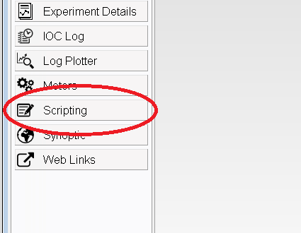

[[Scripting|scripting]] > [[The Scripting Console|the-scripting-console]]

Using Genie Python in the IBEX Client
=====================================

Genie python can be used inside the IBEX client by using the scripting console. To start this press the scripting button in the sidebar:

### Command History

This console will let you type genie commands. Pressing Up/Down arrow keys lets you cycle through previous commands. You can also filter those commands by typing in the start of a line first.

Additionally, pressing "Page Up" will display a window containing the entire command history. Previous commands can be selected from the list or searched for using the text box at the bottom. If you want to search for terms anywhere inside the command (not just at the start), you can do this by prefixing the search term with the * symbol ("match anything"). So the search term `H20` will not match the command `g.load_script("H2O.py")`, but `*H20` will.

Note that the command history is cleared when the IBEX client is restarted, but will be preserved when just the scripting console is restarted.

### Toolbar

The toolbar in the top right provides additional functionality.

From left to right these buttons do the following:

1. Stop the whole console. This will stop the current script and remove the console from view, useful if you are running multiple consoles.
1. Save the text that's in the console to file.
1. Stop the currently running script. This is useful if you realise that the script is doing something wrong. (This can also be done by pressing Ctrl+C)
1. Clear the console. This will remove all the text from the window, be careful though as this WON'T stop the current script.
1. Pin the console. This is not used.
1. Switch to a different console. This will be greyed out if you only have one console running.
1. Start a new console or a new view. You can use this to start a new console by selecting PyDev Console -> Python Console -> Ok. Be careful! Having multiple consoles running can lead to different consoles 'fighting' for control of the instrument.

### Console Memory

As of September 2019, there is a limit on the amount of output that can be kept in the console. This limit is enforced to prevent a long output log from claiming too much memory and slowing down the rest of the control system. 

The console output can also be manually saved & cleared by using the right-click console context menu.

### Search Console

You can search console text by right-clicking on the console, clicking "Find/Replace...", typing your search query in the "Find:" text field and pressing the "Find" button.