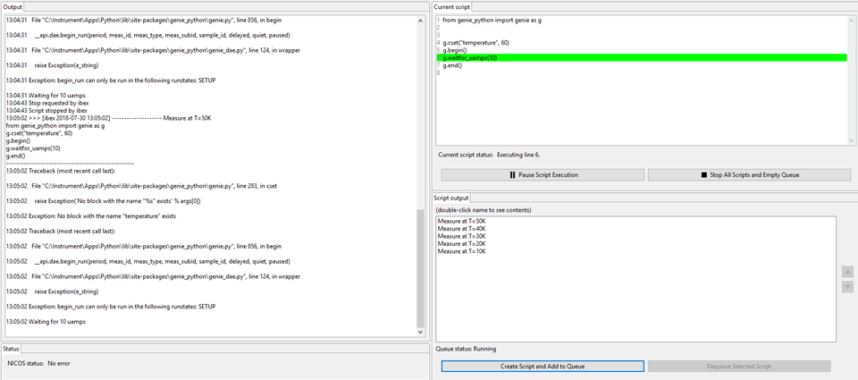

Script Server
#############

Click for larger image

IBEX features a script server, which allows you to write scripts and submit them to the server to run, which enables you to queue multiple scripts which the server will execute for you. Note that you can still use the ::doc:`../Scripting` view to run your scripts. If you'd like us to disable either view button (script server or scripting) on your instrument, please let us know.

To access the script server, click 'Script Server' on the view selector on the left-hand side (see :doc:`Views`). This view allows you to create and queue scripts, as well as show which script is currently running and which line the script server is currently executing. It also allows you to view and edit scripts in the queue by double clicking on them.

You can write scripts within the Script Server view in IBEX or load a pre-written script from elsewhere on the system. You can also save scripts that you have written within IBEX.

Do not use matplotlib commands in scripts which you send to the Script Server because matplotlib will spawn a plot window on the server and your script will pause until the plot window is closed.